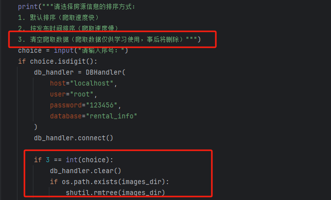
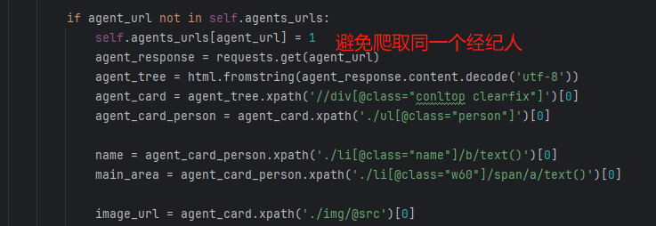
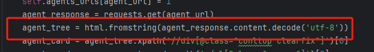

# 网络爬虫与数据收集项目

## 项目概述

本项目的目标是实现一个高效、规范的网络爬虫系统，用于抓取并存储租房信息和房产经纪人信息。系统遵循数据安全策略，确保爬取过程的合法性和数据的安全性。

---

## 功能特性

### 1. 数据爬取与存储
- **目标网站**：[https://zu.fang.com](https://zu.fang.com)
- **数据范围**：
  - 房源信息：户型、面积、位置等。
  - 经纪人信息：姓名、照片、所属公司、管理区域等。
- **策略设计**：
  - 自动跳转详情页抓取数据，避免重复请求。
  - 仅爬取60条数据/次，减少服务器压力。

### 2. 安全与规范
- **数据安全**：
  - 支持一键清除数据功能。
  - 对敏感信息加密存储，防止泄露。
- **合规性**：
  - 仅限学习用途，不涉及敏感数据。
  - 遵守目标网站的协议和反爬策略。
  - 内置一键数据清除功能
    
---

## 技术实现

### 1. 技术选型
- **爬虫框架**：`requests` + `lxml`（XPath解析）
- **图片处理**：`PIL` 库读取和存储图片
- **数据存储**：
  - 结构化数据：MySQL 数据库
  - 图片文件：本地 `images` 目录存储，数据库记录相对路径

### 2. 数据解析流程
1. **网页解析**：
   - 使用 `lxml.html` 解析 HTML 文档。
   - 通过 XPath 提取关键字段。
   - 示例代码：
     ```python
     from lxml import html
     tree = html.fromstring(html_content)
     title = tree.xpath('//div[@class="title"]/text()')[0]
     ```

2. **异常处理**：
   - 过滤无经纪人信息的房源。
   - 处理重复经纪人数据。
   - 解决编码问题（如未指定 UTF-8 的页面）。

   
   

### 3. 数据存储设计
- **MySQL 表结构**：
  ```sql
  CREATE TABLE house (
    id INT PRIMARY KEY,
    title VARCHAR(255),
    area FLOAT,
    location VARCHAR(100),
    broker_id INT
  );